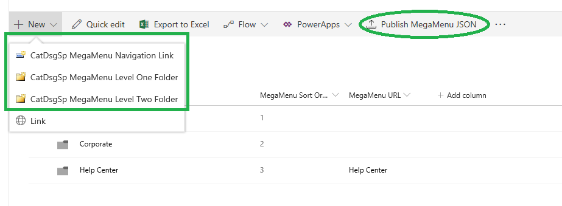
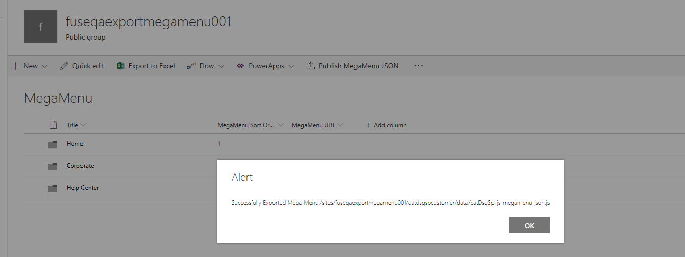
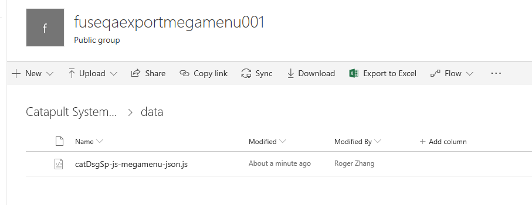

# Mega Menu Provision 
This is used for Mega menu Provisioning, which provide provisioning for mega menu site columns/content types/Upload Jslinks For MegaMenu customized fields/Set Jslinks For Customized Fields/Provisioning mega menu related libraries such as 'Catapult Systems Customer' and 'Catapult Systems Customer'/Add Export Mega menu json file command.

# Status
To be released in 2018...

# Releases
<table>
    <tr>
        <th>Version</th>
        <th>Details</th>
    </tr>
    <tr>
        <td>1.0.0.2</td>
        <td>Coding Completed for 2018 - DSG_Fuse Team Q3 Dev Sprint 1 </td>
    </tr>
</table>

# Owners
- Mike Harris
- Matt Ludtke
- Eric Russell

# Development Team
- Eric Skaggs
- David Warner
- Roger Zhang

# Web Part Type
SharePoint Framework

# Docker Image Compatibility
spfx-v1.5.0-a

# SharePoint Environment Compatibility
<table>
    <tr>
        <th>SharePoint Online</th>
        <th>SharePoint 2013</th>
        <th>SharePoint 2016</th>
        <th>SharePoint 2019</th>
        <th>Classic</th>
        <th>Modern</th>
    </tr>
    <tr>
        <td style="background-color:green;color:white;">Yes</td>
        <td style="background-color:red;color:white;">No</td>
        <td style="background-color:red;color:white;">No</td>
        <td style="background-color:yellow;color:white;">TBD</td>
        <td style="background-color:red;color:white;">No</td>
        <td style="background-color:green;color:white;">Yes</td>
    </tr>
</table>

# SharePoint Environment Prerequisites

## SharePoint Online
- None

## SharePoint 2013
- N/A - SharePoint 2013 does not support SPFx-based solutions

## SharePoint 2016
- Support for SPFx-based solutions (feature pack 2)
- A configured and working app catalog

## SharePoint 2019
- To be determined...

# User Stories and Acceptance Criteria

## Functional
- As a user, I want to be able to see mega menu site columns/site content types created on target site after deployed
- As a user, I want to be able to see mega menu related resources(such as jslinks Files) include libraries(such as 'Catapult Systems Customer' and 'Catapult Systems Customer') created/uploaded on target site after deployed
- As a user, I want to be able to create 'CatDsgSp MegaMenu Navigation Link','CatDsgSp MegaMenu Level One Fold','CatDsgSp MegaMenu Level Two Folder' mega menu item
- As a user, I want to be able to export mega menu json files

# Configuration

## megaMenuListName
Its value should be configured earlier before you package this solution to deploy and is used to let our app know which mega menu items should be used to retrieve data. 

You can go to root folder of this app source code and then located to sharepoint/assets/elements.xml, located to custom action node with name 'Export Maga Menu Json' and then update the value.

## megaMenuJsonFileRelativeUri
Its value should be configured earlier before you package this solution to deploy and is used to let our app know where should be exported mega menu json file uploaded to

You can go to root folder of this app source code and then located to sharepoint/assets/elements.xml, located to custom action node with name 'Export Maga Menu Json' and then update the value.

## megaMenuJsonFileName
Its value should be configured earlier before you package this solution to deploy and is used to let our app know what is the exported mega menu json file name

You can go to root folder of this app source code and then located to sharepoint/assets/elements.xml, located to custom action node with name 'Export Maga Menu Json' and then update the value.

# File Details

## ~Config

### config.json
SPFx package configuration. The only change made here was to add the externals for jQuery and jQueryUI.
### package-solution.js
SPFx solution configuration. Allows us to control the name of the solution as seen in SharePoint, the file name of the output .sppkg, as well as the version number of the solution.

## ~Src/extensions/catDsgSpExt1001ExportMegaMenu

### mystrings.d.ts
TypeScript file that strongly types the strings in the locale files for simple localization.
### loc/en-us.js
Contains strings for the en-us locale.
### loc/zh-cn.js
Contains strings for the zh-cn locale.
### CatDsgSpExt1001ExportMegaMenuCommandSet.ts
TypeScript file that contain main logic for Exporting Mega Menu CommandSet on how to export mega menu list item into json file and upload to sharepoint library
### CatDsgSpExt1001ExportMegaMenuCommandSet.manifest.json
The menifest file to configure the Export Mega Menu Command properties
### export.svg
The Export To Mega menu command icon file

## ~sharepoint/assets

### elements.xml
This file is the spfx provision element file, which define custom actions/Fields/Content Types/ListInstance..., and in our app this file contain all mega menu required elements.

### schema.xml
This file is the spfx provision schema file, which defined the list or library referenced content types/default views... and in our app this file contain mega menu list instance default view and it referenced content types.

## ~provision

### assets
The files in this folder will be treated as to be uploaded assets and the file's folder structure in local machine will be as same as on sharepoint after uploaded and its format should look like below:  
{LibraryName}\{Folder}\{SubFolder}\...\{FileName} 
et: catdsgsp\jsLinks\sitecolumns\catdsgspjslinkcolorpicker\catdsgsp-jslink-sitecolumn-colorpicker.js 
The File will be uploaded to catdsgsp library in folder 'jsLinks/sitecolumns/catdsgspjslinkcolorpicker'

### deployment.ps1
This is the powershell script used to deploy this app to target site level or tenant level and provision mega menu related resources that can't support in spfx or will have issues, which include upload files from local  assets folder to sharepoint/Set Customized field JSLinks/Resolving Mega Menu Customized Fields Display Name Issue...

Note: 
Please execute this script after you run command 'gulp bundle --ship' and 'gulp package-solution --ship' and make sure both of them are succeed. 

# Screenshots

# Test Cases

## Test Case 1
<ol>
    <li>Go to your deployment site collection site content page after you deploy this app</li>
    <li>Ensure that Libraries named 'Catapult Systems Customer'(url is:catdsgspcustomer)/'Catapult Systems'(url is:catdsgsp)/'MegaMenu'(url is :MegaMenu) are all exists</li>
    <li>Open Catapult Systems Customer library and you will see the jslinks files are exists as below paths 
        <ol>
           <li>/jsLinks/sitecolumns/catdsgspjslinkcolorpicker/catdsgsp-jslink-sitecolumn-colorpicker.js</li>
           <li>/jsLinks/sitecolumns/catdsgspjslinkiconography/catdsgsp-jslink-sitecolumn-iconography.js</li>
           <li>/jsLinks/sitecolumns/catdsgspjslinkiconography/catdsgsp-jslink-sitecolumn-iconography.css</li>
           <li>/jsLinks/sitecolumns/catdsgspjslinkiconography/catdsgsp-jslink-sitecolumn-iconography-json.js</li>
        </ol>
    </li>
    <li>Go Back to Site content and open Mega menu list and make sure you are on modern UI not the classic one</li>
    <li>Ensure you will see the 'Publish MegaMenu JSON' command with upload icon is showed on command bar </li>
    <li>Click the new item link and ensure you can see the context menu items: 'CatDsgSp MegaMenu Navigation Link','CatDsgSp MegaMenu Level One Fold','CatDsgSp MegaMenu Level Two Folder'</li>
</ol>

## Test Case 2
<ol>
    <li>Go to mega menu list and make sure there have no items and the mega menu json file storage folder such as /catdsgspcustomer/data  was not exists</li>
    <li>Click 'Publish MegaMenu Json' command verify the alert message of there have no data in mega menu list will be displayed</li>
    <li>Go to catdsgspcustomer library and make sure the data folder was automatically created</li>
    <li>Go back to mega menu list and click new item link to Create 'CatDsgSp MegaMenu Navigation Link','CatDsgSp MegaMenu Level One Fold','CatDsgSp MegaMenu Level Two Folder' content type item one by one
    <li>Ensure each items can be successfully created</li>
    <li>Edit each created content type items and ensure they can be editable and saved correctly</li>
    <li>Go back to mega menu list and click 'Publish MegaMenu Json' command </li>
    <li>Verify the successfully export mega menu to specific path(such as catdsgspcustomer/data/catDsgSp-js-megamenu-json.js) message box will be showed</li>
    <li>Go to catdsgspcustomer library and based on json storage path such as catdsgspcustomer/data/catDsgSp-js-megamenu-json.js verify the file exists </li>
</ol>
